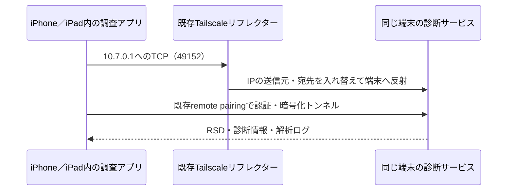

# 端末自身から診断・日次ログを取得する調査（2026-10-08）

既存PC連携を維持したまま、iPhone/iPad自身の診断サービスに到達できるか、別Bundle IDの実機専用アプリで検証した。本体のパーサー・記録保存・既存ペアリングは変更していない。この調査コードは製品ターゲットやTestFlightには含めない。

## 製品ベータへの引き継ぎ

2026-10-09には通常のMochiLog 4.0.0（1041）で、利用者がLocalDevVPNを選んだiPadのログ取得を検証した。PC側のホスト名によるOS認証識別子の不一致を修正し、既存ペアリングから認証情報を取り直した後に読み取り成功。以前のPC収集から保存済みの4件は重複を防いだ。[実機確認メモ](real-device-verification-2026-10-09.md)を参照。

以下は10月8日時点の独立した研究アプリの記録。今回の通常ベータの結果と、Tailscaleリフレクターによる研究の結果を混同しない。

## 構成と実際の経路



Macは調査アプリのビルド・インストール・結果確認に使用した。診断要求やログ本体の取得をMacから中継していない。RSD上のlockdownのUniqueDeviceIDを一時設定の期待値と照合し、違う端末なら診断要求を止める。

これはLocalDevVPNのパケット反射という考え方を、稼働中のTailscale＋外部リフレクターで検証したもの。LocalDevVPNアプリ自体を今回インストールしたわけではない。外部サーバーへの通信が必要なので、端末内だけで完結するLocalDevVPNとオフライン性や運用条件は同一ではない。Tailscale設定・既存リフレクター・ACLは変更していない。

## 検証の段階

- iOS/iPadOS 27.2のiPhone 17とiPad Proで、端末発の10.7.0.1:49152への接続と認証に成功。
- `com.apple.mobile.diagnostics_relay.shim.remote` と `com.apple.crashreportcopymobile.shim.remote` が利用可能。
- `IOPMPowerSource`の応答に、数値のCycleCount・DesignCapacity・AppleRawMaxCapacity・FullChargeCapacity・NominalChargeCapacityがあることを両端末で確認。
- crash-reportサービスのルート、`/Retired`、`ProxiedDevice-…`とその`Retired`の一覧を読み、AFCを読み取り専用で開いてファイル末尾まで取得。
- `Analytics-Census-*`、`session`を含む名前などを日次ログの候補から除外。本文のバッテリー項目と行数も確認する。
- ファイルサイズ512KiB以上・48MiB未満という条件は、今回の読み取りサンプルを選ぶためだけのもの。これを製品の対象外判定へ流用しない。
- OSの分類には先頭JSONの`os_version`を使い、`Watch OS`と`watchOS`の空白・大文字小文字の表記差を正規化する。本文の他の場所にwatchOSという文字があってもWatchログとは判定しない。
- 62078の従来形式では、リフレクター経由のTCP接続後、QueryType要求で切断。127.0.0.1:49152はTCP接続自体が成功しても、認証トンネルは接続リセットになった。TCP接続成功だけを診断取得成功とは数えない。

結果のファイルサイズ・行数・ハッシュは下の実測表へ記録する。バッテリーの実値やログ本文、UDID、鍵はリポジトリへ残さない。

## 日次ログの実測（ヘッダー分類の再検証後）

2026-10-08 20:24 JST開始。いずれも自己端末IDの照合、EOFまでの読み取り、CycleCountとNominalChargeCapacityの本文キーを確認。

| 取得した端末 | ログ日付 | ヘッダーOS | バイト数 | 行数 | 結果 |
|---|---|---|---:|---:|---|
| iPhone 17 | 2026-10-08 | iPhone OS | 23,106,915 | 34,647 | 末尾まで取得・電池項目あり |
| iPhone 17 | 2026-10-08 | watchOS | 13,322,676 | 21,474 | 末尾まで取得・電池項目あり |
| iPad Pro（M4） | 2026-10-06 | iPhone OS | 10,164,421 | 15,214 | 末尾まで取得・電池項目あり |

iPhoneから取得した本体ログのSHA-256は `ae551aaacd16895d5b276e0cc2b0996814818ab1f48906d2a7b0dbdaf6828da4`。
iPadから取得した本体ログのSHA-256は `49d687f629dde411dcd83d4bd150259cf367f3d6a8af28b21ff905c44eaed551`。
段階ごとの値を含まない結果は `docs/research/localdev-2026-10-08/` に保存。

初期の調査出力には、本文中のwatchOSという文字でWatchログと誤判定した結果があった。先頭JSONのos_versionで再検証して訂正した。その後、既存PC収集と同様にiPhone内の`ProxiedDevice-…`配下まで調べ、ヘッダーが`Watch OS 27.2`の別ファイルを取得した。WatchファイルのSHA-256は `3ab9a235f05a973f0d1f6515e7d234991c94da0e8d9d68c01b663505a42e1694` で、PC側に保存済みの同日Watchログと完全一致。上の表はこの最終検証の実測である。

## 残る条件

1. **完全にPC不要な初回設定は未検証。** 今回はMacにある対象端末の既存remote pairing情報を、調査アプリへ一時的に渡した。初期状態からiPhoneだけで信頼を確立できる証明にはならない。
2. **Developer Modeオフでは未検証。** 実行したのはDeveloper Modeがオンの実機用Debugアプリ。従来のPC側収集がオフでも動くという結果と、今回の自己接続経路は別に扱う。
3. **ロック中・バックグラウンド・再起動直後は未検証。** 今回はアプリを前面で実行した。調査中だけ自動スリープを止め、終了時に戻す。
4. **App Store/TestFlightでの承認・動作は未検証。** OS診断プロトコルとVPN、初回信頼、依存ライセンスを含めた製品化の検討が必要。調査成功を理由に既存PC連携を削除しない。
5. iOS/iPadOS 27.2での実測であり、最低対応OSや別OS版の保証にはしない。モバイル回線への切り替え・Developer Modeの切り替えは今回ユーザーに要求していない。

## 実装・再現

`scripts/research/LocalDevDiagnosticsProbe/`にSwift UI、Swiftからのidevice FFI呼び出し、XcodeGen定義、既存鍵を形式変換する開発用Pythonスクリプトを置いた。iOS上でPythonやpymobiledevice3を起動する構成ではない。pymobiledevice3形式の既存remote pairingを読めるようにした上で、診断プロトコルには継続保守されているideviceを使い、自作の暗号・トンネル実装を避けた。

今回使ったarm64 iOS用FFIはStikDebugの参照checkout `871f1461d92b358624ec044700ea348d379fdae5` にある `StikDebug/idevice/` のヘッダー・module.modulemap・静的ライブラリ。`libidevice_ffi.a`のSHA-256:

```text
4db23fe1d342927b9480bb9a8577f219994365621dc28aa0018e23ea1990ecc8
```

FFIのメモリ所有権はideviceソース `d32c8189c51c2789496b0768039419c3705498c3` も照合した。`crash_report_client_ls`の返却配列にはnull終端が1個加わるため、既存のCString配列解放関数へ`count + 1`を渡す。`crash_report_client_to_afc`はcrashクライアントを消費するので二重解放しない。FFI呼び出しは同じ同期処理のスレッドで行う。

依存ファイルを`Build/localdev-probe-library/`に置き、以下でビルドする。ライブラリ・ペアリング情報・実機結果・生成されたXcodeプロジェクトはコミットしない。ideviceのMITライセンスは調査フォルダへ保存。参照バイナリの全依存の再配布監査は済んでいないため、バイナリは配布物へ追加しない。

```sh
xcodegen generate --spec scripts/research/LocalDevDiagnosticsProbe/project.yml \
  --project scripts/research/LocalDevDiagnosticsProbe
xcodebuild -project scripts/research/LocalDevDiagnosticsProbe/LocalDevDiagnosticsProbe.xcodeproj \
  -scheme LocalDevDiagnosticsProbe -configuration Debug \
  -destination 'generic/platform=iOS' -derivedDataPath Build/localdev-probe-derived build
```

実機用の研究アプリをインストール後、`prepare_inputs.py --pair-record /path/to/own/remote.plist --expected-udid OWN_UDID`で専用一時フォルダを作る。出力するのは一時フォルダのパスだけ。元ファイルは書き換えない。鍵は32bytes、ディレクトリは0700、ファイルは0600。

`probe-pairing.plist`と`probe-identity.plist`をその端末の研究アプリのDocumentsへコピーして起動する。鍵入力はロード直後、ID入力も終了時に削除。ネットワーク処理で得た本文はメモリで検証して破棄し、`research-results.json`には段階・項目名・サイズ・ハッシュだけを書く。研究アプリの終了後、入力が残っていないことも確認し、開発Macの一時フォルダを削除する。

上流の`tunnel_create_rppairing`にはpair-verify失敗後のpair-setupへのフォールバックがある。verify-only APIではないことに注意し、未知の端末や新規ペアリングの検証へそのまま流用しない。今回の成功実行は既存ペアリングを利用した。

## 後片付け

両端末の入力鍵・IDファイルが研究アプリから削除されていることを確認し、研究アプリをアンインストールしてMochiLog本体へ戻す。開発Macの一時入力も削除する。ソースと値を含まない結果を残し、MochiLog本体の記録・PCペアリングは維持する。

## 一次資料

- [LocalDevVPN](https://github.com/jkcoxson/LocalDevVPN)
- [sidestore-vpnの反射実装](https://github.com/xddxdd/sidestore-vpn/blob/master/src/main.rs)
- [StikDebug参照commit](https://github.com/StikDebug/StikDebug/tree/871f1461d92b358624ec044700ea348d379fdae5)
- [idevice](https://github.com/jkcoxson/idevice)
- [FFI tunnel provider](https://github.com/jkcoxson/idevice/blob/d32c8189c51c2789496b0768039419c3705498c3/ffi/src/tunnel_provider.rs)
- [pymobiledevice3のhost identifier](https://github.com/doronz88/pymobiledevice3/blob/v11.19.1/pymobiledevice3/pair_records.py)
